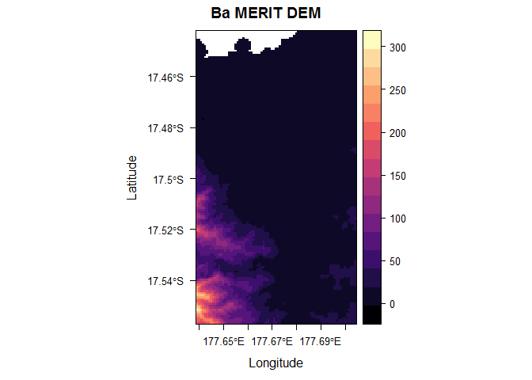

<!-- README.md is generated from README.Rmd. Please edit that file -->
### DEMsimulation

R Package to simulate plausible versions of SRTM and MERIT DEMs in floodplains. DEMs can be simulated from either:

-   'Average' Floodplain semi-variogram
-   Semi-variograms by landcover class

These semi-variograms were calculated for 20 floodplain locations around the world. More details of the procedure can be found in:

### Installation

Currently, DEMsimulation is only available on Github. To download and install use the following:

``` r
devtools::install_github("laurencehawker/DEMsimulation")
```

### Using DEMsimulation

First, load DEMsimulation

``` r
library(DEMsimulation)
```

Next load a DEM. For this example, we will use the MERIT DEM for Ba, Fiji which is included in the package. Oterwise load your DEM (MERIT or SRTM) using the raster package. To download MERIT DEM data please see [MERIT DEM](http://hydro.iis.u-tokyo.ac.jp/~yamadai/MERIT_DEM/).

``` r

#Load MERIT DEM for Ba
data("Ba_MERIT")

#Show raster details of Ba
Ba_MERIT
#> class       : RasterLayer 
#> dimensions  : 138, 79, 10902  (nrow, ncol, ncell)
#> resolution  : 0.0008333334, 0.0008333334  (x, y)
#> extent      : 177.6388, 177.7046, -17.55708, -17.44208  (xmin, xmax, ymin, ymax)
#> coord. ref. : +proj=longlat +datum=WGS84 +no_defs +ellps=WGS84 +towgs84=0,0,0 
#> data source : /Users/laurencehawker/Documents/DEMsimulation/data-raw/Ba_MERIT_Z.tif 
#> names       : Ba_MERIT_Z 
#> values      : -3.155631, 297.4111  (min, max)

#Plot Ba DEM
plot(Ba_MERIT)
```



There is an option to simulate by landcover semi-variograms, whereby the DEM is divided by landcover class, with the appropriate semi-variogram applied to related pixels. When a landcover type is not within the DEMsimulation database, the average floodplains semi-vaiogram is used. The available landcover semi-variograms are:

    #>  [1] "Overall"                                               
    #>  [2] "Mosaic cropland (>50%) / natural veg"                  
    #>  [3] "Grassland"                                             
    #>  [4] "Mangroves"                                             
    #>  [5] "Cropland Irrigated"                                    
    #>  [6] "Mosaic natural vegetation "                            
    #>  [7] "Tree cover BL/Evg >15%"                                
    #>  [8] "Shrubland"                                             
    #>  [9] "Shrubland Deciduous"                                   
    #> [10] "Shrub or herbaceous cover"                             
    #> [11] "Bare areas"                                            
    #> [12] "Tree cover BL/Dec >15%"                                
    #> [13] "Cropland Herbaceous cover"                             
    #> [14] "Cropland"                                              
    #> [15] "Mosaic tree and shrub (>50%) / herbaceous cover (<50%)"
    #> [16] "Mosaic herbaceous cover (>50%) / tree and shrub (<50%)"
    #> [17] "Urban areas"                                           
    #> [18] "Tree cover NL/Dec >15%"                                
    #> [19] "Tree cover BL/Dec >40% (closed)"                       
    #> [20] "Tree cover NL/Evg >15% "                               
    #> [21] "Tree cover (flooded, fresh, brackish)"
