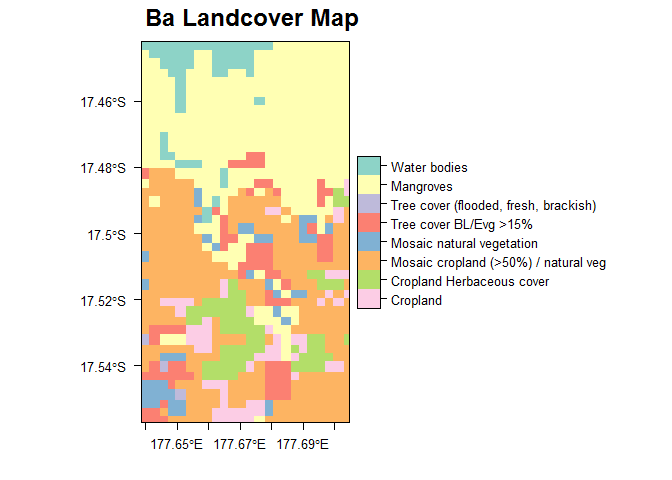
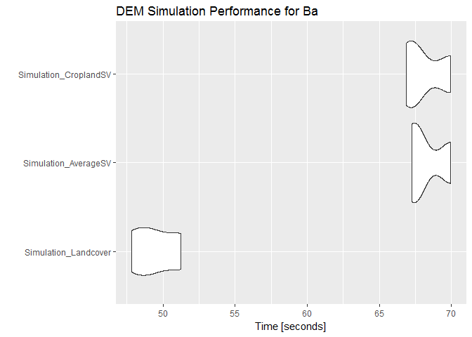

<!-- README.md is generated from README.Rmd. Please edit that file -->
DEMsimulation
=============

R Package to simulate plausible versions of SRTM and MERIT DEMs in floodplains. DEMs can be simulated from either:

-   'Average' Floodplain semi-variogram
-   Semi-variograms by landcover class

These semi-variograms were calculated for 20 floodplain locations around the world. More details of the procedure can be found in:

Hawker, L., Rougier, J., Neal, J., Bates, P., Archer, L., & Yamazaki, D. (2018). Implications of Simulating Global Digital Elevation Models for Flood Inundation Studies. Water Resources Research.<DOI:10.1029/2018WR023279>

The spatial error structures used to simulate the DEMs have only been calculated for floodplain locations, and thus should only be applied to floodplain locations. A similar procedure can be used for landscapes with steep relief with several papers assessing DEM simulation and slope failure at the bottom of this page.

Installation
------------

Currently, DEMsimulation is only available on Github. To download and install use the following:

``` r
devtools::install_github("laurencehawker/DEMsimulation")
```

Using DEMsimulation
-------------------

First, load DEMsimulation

``` r
library(DEMsimulation)
#> Warning: package 'raster' was built under R version 3.4.4
#> Warning: package 'sp' was built under R version 3.4.4
#> Warning: package 'gstat' was built under R version 3.4.4
```

### DEM

Next load a DEM. For this example, we will use the MERIT DEM for Ba, Fiji which is included in the package. Oterwise load your DEM (MERIT or SRTM) using the raster package. To download MERIT DEM data please see [MERIT DEM](http://hydro.iis.u-tokyo.ac.jp/~yamadai/MERIT_DEM/). Do note the semi-variograms have so far only been calculated for MERIT and SRTM at 90m resolution.

``` r
library(rasterVis)

#Load MERIT DEM for Ba
data("Ba_MERIT")

#Show raster details of Ba
Ba_MERIT
#> class       : RasterLayer 
#> dimensions  : 138, 79, 10902  (nrow, ncol, ncell)
#> resolution  : 0.0008333334, 0.0008333334  (x, y)
#> extent      : 177.6388, 177.7046, -17.55708, -17.44208  (xmin, xmax, ymin, ymax)
#> coord. ref. : +proj=longlat +datum=WGS84 +no_defs +ellps=WGS84 +towgs84=0,0,0 
#> data source : C:\Users\lh14461\PhD\DEM Work\DEMsimulation\data-raw\Ba_MERIT_Z.tif 
#> names       : Ba_MERIT_Z 
#> values      : -3.155631, 297.4111  (min, max)

#Plot Ba DEM
levelplot(Ba_MERIT,margin=FALSE,main='Ba MERIT DEM')
```


There is an option to simulate by landcover semi-variograms, whereby the DEM is divided by landcover class, with the appropriate semi-variogram applied to related pixels. When a landcover type is not within the DEMsimulation database, the average floodplains semi-vaiogram is used. The available landcover semi-variograms are:

``` r
#Load MERIT Semi-variograms and display available Landcover types
data("MERIT_AvgSV_LC")
names(MERIT_Avg_LC)
#>  [1] "Overall"                                               
#>  [2] "Mosaic cropland (>50%) / natural veg"                  
#>  [3] "Grassland"                                             
#>  [4] "Mangroves"                                             
#>  [5] "Cropland Irrigated"                                    
#>  [6] "Mosaic natural vegetation "                            
#>  [7] "Tree cover BL/Evg >15%"                                
#>  [8] "Shrubland"                                             
#>  [9] "Shrubland Deciduous"                                   
#> [10] "Shrub or herbaceous cover"                             
#> [11] "Bare areas"                                            
#> [12] "Tree cover BL/Dec >15%"                                
#> [13] "Cropland Herbaceous cover"                             
#> [14] "Cropland"                                              
#> [15] "Mosaic tree and shrub (>50%) / herbaceous cover (<50%)"
#> [16] "Mosaic herbaceous cover (>50%) / tree and shrub (<50%)"
#> [17] "Urban areas"                                           
#> [18] "Tree cover NL/Dec >15%"                                
#> [19] "Tree cover BL/Dec >40% (closed)"                       
#> [20] "Tree cover NL/Evg >15% "                               
#> [21] "Tree cover (flooded, fresh, brackish)"
```

### Landcover

The Landcover classes were taken from the Climate Change Institute [CCI](http://maps.elie.ucl.ac.be/CCI/viewer/index.php) for the year 2000. The user can either download this themselves, or use the download.CCI function in DEMsimulation. The download.CCI function is handy as it downloads and resamples the landcover data from it's native resolution of 300m to 90m (DEM resolution).

``` r
#Download Landcover data and resample.
#Note this downloads the CCI Landcover for 2000 for the whole world and is 300MB!
LC_Map <- download.CCI(Ba_MERIT)
LC_Map
```

``` r
#Or load Ba CCI map from DEMsimulation package
data("Ba_CCI")
Ba_CCI
#> class       : RasterLayer 
#> dimensions  : 138, 79, 10902  (nrow, ncol, ncell)
#> resolution  : 0.0008333334, 0.0008333334  (x, y)
#> extent      : 177.6388, 177.7046, -17.55708, -17.44208  (xmin, xmax, ymin, ymax)
#> coord. ref. : +proj=longlat +datum=WGS84 +no_defs +ellps=WGS84 +towgs84=0,0,0 
#> data source : C:\Users\lh14461\PhD\DEM Work\DEMsimulation\data-raw\Ba_CCI.tif 
#> names       : Ba_CCI 
#> values      : 10, 210  (min, max)

#Plot
library(rasterVis)
library(grid)
CCIf <- as.factor(Ba_CCI)
## Add a landcover column to the Raster Attribute Table
rat <- levels(CCIf)[[1]]
cci_lookup <- DEMsimulation::cci_lookup #Landcover lookup Table
rat[["landcover"]] <- cci_lookup$LCCOwnLabel[match(rat$ID,cci_lookup$NB_LAB)]
levels(CCIf) <- rat

levelplot(CCIf, col.regions=rev(brewer.pal(nrow(rat),'Set3')), xlab="", ylab=""
          ,main=list(paste0('Ba Landcover Map'),adj=0.75,cex=1.5, x=unit(0.35, "npc")))
```



``` r
#Alternatively load from local disk and resample
LC_Map_local <-raster('ESA_Landcover_Map.tif') #Load CCI Landcover Map from local computer.Edit filename as required
ex<- raster::extent(Ba_MERIT) #Extent of DEM
LC_Map_local <- raster::crop(LC_Map_local,ex) #Crop CCI Landcover Map
CCI <-raster::resample(lcmap_rascrop,targetDEM,method='ngb') #Resample to DEM resolution
```

### DEM Simulation

Now to simulate those DEMs! The user can choose to simulate either by landcover class, the 'average' floodplain semi-variogram, or by any other landcover semivariogram.

The user should be warned that simulating DEMs can be slow, so please be patient and sensible with the size of the DEM for the computer that is being used for the work.

The DEM simulation code mainly uses the excellent [gstat package](https://cran.r-project.org/web/packages/gstat/index.html). Please check the documentation in gstat for more information.

``` r
###Simulate DEM by landcover
sim_LC <- demsimulation_LC(Ba_MERIT,LC_map = Ba_CCI,sv='MERIT', maxdist = 0.01, nsim = 20) 

#Write simulated Rasters
#Writes out the simulated rasters with a numbered suffix in geotiff format. See writeRaster function documentation in the raster package for other formats.
writeRaster(sim_LC,filename = 'Ba_MERIT_LC', bylayer=TRUE, suffix='numbers',format='GTiff')

#####

#Simulate DEMs by average floodplain semi-variogram
modelselect <- MERIT_Avg_LC$Overall #Average floodplain semi-variogram
#Simulate DEMs by average floodplain semi-variogram
sim_avg <- demsimulation(Ba_MERIT, sv='MERIT', lc='Overall', maxdist=0.01, nsim=10)
writeRaster(sim_avg,filename = 'Ba_MERIT_avgsv', bylayer=TRUE, suffix='numbers',format='GTiff')

#####

#Simulate DEMs by cropland landcover class. Any other landcover can be selected
modelselectCrop <- MERIT_Avg_LC$Cropland #Cropland semi-variogram
#Simulate DEMs by Cropland semi-variogram
sim_Crop <- demsimulation(Ba_MERIT, sv='MERIT', lc='Cropland', maxdist=0.01, nsim=10)
writeRaster(sim_Crop,filename = 'Ba_MERIT_cropsv', bylayer=TRUE, suffix='numbers',format='GTiff')
```

Performance
-----------

Let's assess the speed of DEM simulation

``` r
#For the Ba Catchment. DEM size 79x138 pixels
library(microbenchmark)
#> Warning: package 'microbenchmark' was built under R version 3.4.4
library(ggplot2)
mbm <- microbenchmark(
  'Simulation_Landcover' = {Simulation_Landcover <- demsimulation_LC(Ba_MERIT,LC_map = Ba_CCI,sv='MERIT', maxdist = 0.01, nsim = 20,debuglevel = 0)},
  'Simulation_AverageSV' = {Simulation_AverageSV <- demsimulation(Ba_MERIT, sv='MERIT', lc='Overall', maxdist=0.01, nsim=20,debuglevel = 0)},
  'Simulation_CroplandSV' = {Simulation_CroplandSV <- demsimulation(Ba_MERIT, sv='MERIT', lc='Cropland', maxdist=0.01, nsim=20,debuglevel = 0)},
  times = 3,unit = "s"
)
#> [1] "Using MERIT Semi-variograms"
#> [1] "Using MERIT Semi-variograms"
#> [1] "Using Overall semi-variograms"
#> [1] "Using MERIT Semi-variograms"
#> [1] "Using Cropland semi-variograms"
#> [1] "Using MERIT Semi-variograms"
#> [1] "Using Overall semi-variograms"
#> [1] "Using MERIT Semi-variograms"
#> [1] "Using MERIT Semi-variograms"
#> [1] "Using MERIT Semi-variograms"
#> [1] "Using Overall semi-variograms"
#> [1] "Using MERIT Semi-variograms"
#> [1] "Using Cropland semi-variograms"
#> [1] "Using MERIT Semi-variograms"
#> [1] "Using Cropland semi-variograms"
autoplot(mbm,log=FALSE)+labs(title='DEM Simulation Performance for Ba')
```



Use in Flood Models
-------------------

The main motivation behind this work was to simulate DEMs for flood studies as typically only a single DEM are used, especially in data-sparse areas. In our [WRR paper](https://agupubs.onlinelibrary.wiley.com/doi/pdf/10.1029/2018WR023279) we simulate DEMs for An Giang Province in Vietnam and Ba in Fiji, and use the simulated DEMs in a LISFLOOD-FP flood model. By using multiple DEMs, we can produce a probablistic flood map based on topographic uncertainty. Therefore, the DEM simulation procedure is invaluable in helping to explore the impact of topographic uncertainty on flood inundation extent. LISFLOOD-FP is freely available for non-commercial use from [here](http://www.bristol.ac.uk/geography/research/hydrology/models/lisflood/)

DEM simulation has also recently been applied to a study assessing river-floodplain connectivity in the [Congo Basin](https://agu.confex.com/agu/18chapman4/meetingapp.cgi/Paper/341976).

Future Plans
------------

Future plans include adding more locations (and thus landcover classes), and assessing the NASADEM when it is released.

Citation
--------

When using this code please cite:

Hawker, L., Rougier, J., Neal, J., Bates, P., Archer, L., & Yamazaki, D. (2018). Implications of Simulating Global Digital Elevation Models for Flood Inundation Studies. Water Resources Research.<DOI:10.1029/2018WR023279>

When using the MERIT DEM please cite:

Yamazaki, D., D. Ikeshima, R. Tawatari, T. Yamaguchi, F. O. Loughlin, J. C. Neal, C. C. Sampson, S. Kanae, and P. D. Bates (2017), A high accuracy map of global terrain elevations, Geophysical Research Letters, 44(11), 5844–5853, <doi:10.1002/2017GL072874>.

References & related articles
-----------------------------

### This Work

-   Hijmans, R. J., J. van Etten, J. Cheng, M. Mattiuzzi, M. Sumner, J. A. Greenberg, A. Bevan, and A. Shortridge (2016), Raster: Geographic Data Analysis and Modeling.
-   Neal, J., G. Schumann, and P. Bates (2012), A subgrid channel model for simulating river hydraulics and floodplain inundation over large and data sparse areas, Water Resources Research, 48(June), 1–16, <doi:10.1029/2012WR012514>.
-   Pebesma, E. J. (2004), Multivariable geostatistics in S: The gstat package, Computers and Geosciences, 30(7), 683–691, <doi:10.1016/j.cageo.2004.03.012>.
-   Pekel, J.-f., A. Cottam, N. Gorelick, and A. S. Belward (2016), High-resolution mapping of global surface water and its long-term changes, Nature, 540(7633), 418–422, <doi:10.1038/>
-   Rougier, J., and A. Zammit-Mangion (2016), Visualization for Large-scale Gaussian Updates, Scandinavian Journal of Statistics, 43(4), 1153–1161, <doi:10.1111/sjos.12234>.
-   Yamazaki, D., D. Ikeshima, R. Tawatari, T. Yamaguchi, F. O. Loughlin, J. C. Neal, C. C. Sampson, S. Kanae, and P. D. Bates (2017), A high accuracy map of global terrain elevations, Geophysical Research Letters, 44(11), 5844–5853, <doi:10.1002/2017GL072874>.

### Good Geostatistic Overviews

-   Goovaerts, P. (1997), Geostatistics for natural resources, 90–125 pp., Oxford University Press, Oxford.
-   Kyriakidis, P. C., A. M. Shortridge, M. F. Goodchild, P. C. Kyriakidis, A. M. Shortridge, and M. F. Goodchild (1999), Geostatistics for conflation and accuracy assessment of digital elevation models, International Journal of Geographical Information Science, 13(7), 677–707.

### Other DEM Simulation Studies

-   Darnell, A. R., N. J. Tate, and C. Brunsdon (2008), Improving user assessment of error implications in digital elevation models, Computers, Environment and Urban Systems, 32(4), 268–277, <doi:10.1016/j.compenvurbsys.2008.02.003>.
-   Davis, T. J., and C. P. Keller (1997), Modelling uncertainty in natural resource analysis using fuzzy sets and monte carlo simulation: Slope stability prediction, International Journal of Geographical Information Science, 11(5), 409–434, <doi:10.1080/136588197242239>.
-   Fereshtehpour, M., and M. Karamouz (2018), DEM Resolution Effects on Coastal Flood Vulnerability Assessment : Deterministic and Probabilistic Approach. Accepted Manuscript, Water Resources Research, 54, <doi:10.1029/2017WR022318>.
-   Holmes, K. W., O. Chadwick, and P. C. Kyriakidis (2000), Error in a USGS 30-meter digital elevation model and its impact on terrain modeling, Journal of Hydrology, 233, 154–173, <doi:10.1016/S0022-1694(00)00229-8>.
-   LaLonde, T., A. Shortridge, and J. Messina (2010), The Influence of Land Cover on Shuttle Radar Topography Mission (SRTM) Elevations in Low-relief Areas, Transactions in GIS,
-   Leon, J. X., G. B. M. Heuvelink, and S. R. Phinn (2014), Incorporating DEM uncertainty in coastal inundation mapping, PLoS ONE, 9(9), 1–12, <doi:10.1371/journal.pone.0108727>.
-   Oksanen, J., and T. Sarjakoski (2005), Error propagation of DEM-based surface derivatives, Computers and Geosciences, 31(8), 1015–1027, <doi:10.1016/j.cageo.2005.02.014>.
-   Wilson, M. D., and P. M. Atkinson (2005), Prediction uncertainty in floodplain elevation and its effect on flood inundation modelling, in GeoDynamics, edited by P. M. Atkinson, G. M. Foody, S. Darby, and F. Wu, chap. 14, pp. 185–202, Wiley, Chichester.
